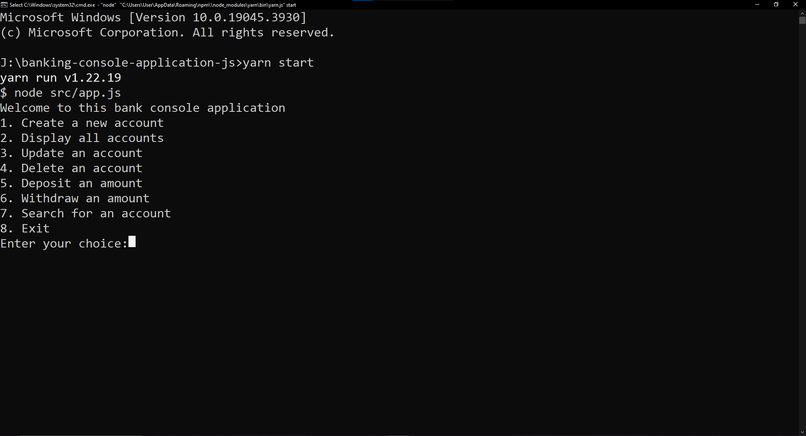

### Simple Banking Console Application

# Problem Statement

- Implement a simple banking application. A bank may have several types of accounts say current account, saving account, salary account etc. An account may have fields like name, number, creation date and balance etc. After starting the application, users will have 8 different choices as input from 1 to 8 through the console.

- Based on the user input, the following operations will be performed

1. Create a new account
2. Display all accounts
3. Update an account
4. Delete an account
5. Deposit an amount into your account
6. Withdraw an amount from your account
7. Search for account
8. Exit

# Constraints

- Each account type may require a minimum balance to open the account.
- Each account type may require to keep a minimum balance before withdrawing an amount.

# Technology Used

`Javascript`

# How to run the project

1. **Clone this Github repository: https://github.com/farhanhasindipro25/banking-console-application-js.git**

2. Open your Command Prompt for Windows, or your Terminal for Mac.

3. Run the following command:

`yarn start`

4. You will see:

5. Input the numbers from 1-8 to enjoy!
